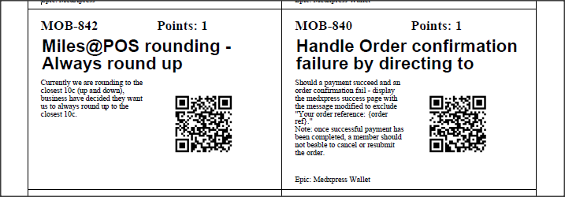

# JIRA Card Printer

## Introduction

This is a quick and dirty script to generate physical tickets for a scrum board from JIRA tickets.

Currently it involves a bit of manual processing, but over time I'd like to automate this.

## What do you get?

As it is now, the app will generate a PDF with 8 cards per page in the below format:

## Current issues

One major bug is that it will ignore the last card if you try to generate an odd number of cards. Both input files have to contain an even number of records.

If anything is missing or not in exactly the right format, the app will crash or just not generate everything (Often failing silently).

## Future plans:

* Connect to the API to grab issues from a specific sprint.
* Fix bugs (Especially odd number of cards issue mentioned above).
* Make it more robust.
* Make it more configurable.

## Usage instructions:

The app expects 2 input files in the project directory:

* tickets.csv
* subtasks.csv

You need to grab these from the issue navigator in JIRA.

### Getting the tickets.csv file 

The simplest ways to get the issues in the issues navigator is to either select them all in the backlog of your board, right clicking and selecting "View in issue navigator".

You can then select "Export" -> "Excel (All fields)" to get the issues in an excel file. 

Once you download this file, you need to open it and remove the first 3 rows, the image at the top of the file and the last row. 

Once you've done this, you can save it as a CSV file withe the name tickets.csv in the directory where you checked out this code (The same directory as this README.md).

### Getting the sub-tasks.csv file

On the same issue navigator screen where you got the original data, you should see a JQL query like: 

`KEY IN (XXX-YYY, XXX-YYY, ...)` 

You need to change this to read:

`parent IN (XXX-YYY, XXX-YYY, ...) AND type=Sub-task`

And then go through exactly the same steps to download and clean the data as for the tickets.csv.

Once you've done this, you can save it as a CSV file with the name sub-tasks.csv in the directory where you checked out this code (The same directory as this README.md).

### Running the app
You can now run the app using Maven:

`mvn clean compile package exec:java -Dexec.mainClass=CardPrinter.App`

This will generate a file called `test.pdf` with all your tickets.